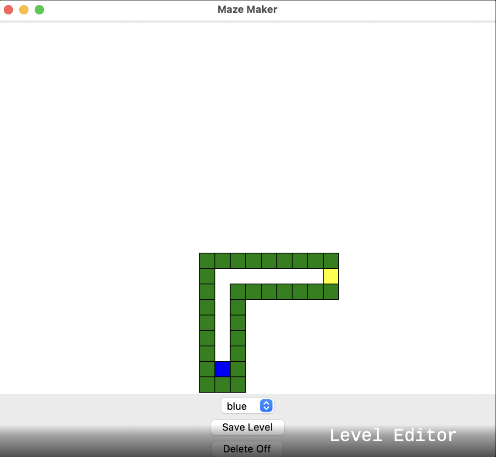
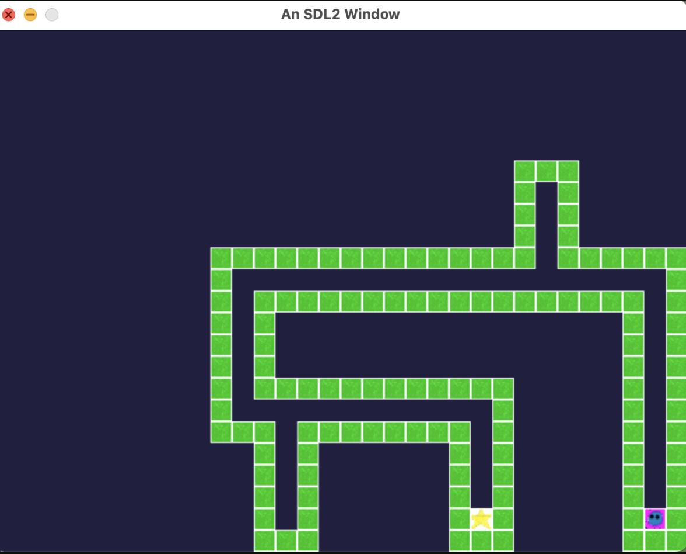
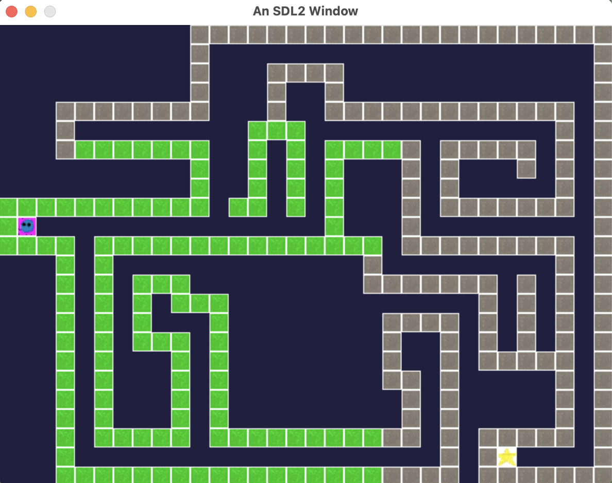

## Title:
 
Game Engine - Maze Creator

## YouTube:
 
https://www.youtube.com/watch?v=cPN3Nh1vaRk

## Overview:

For this project, I created a game engine that utilizes data-driven design to create, save, and load levels for a maze game. The level editor was created using Tkinter. After the level has been created, it is output to a text file that contains the type of tile and its location. This file can be read into the game engine to load the given level. The player can then play through the levels moving their character through the maze to the star. Upon reaching the star, the next level will be loaded.

## Screenshots

<b>Level Editor</b>

<b>Simple Level Creation</b>

<b>Complex Level Creation</b>

